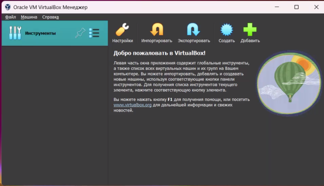
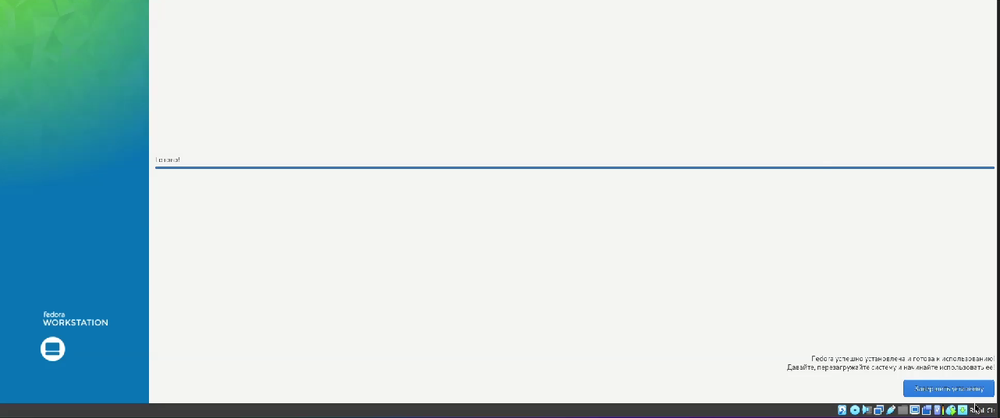
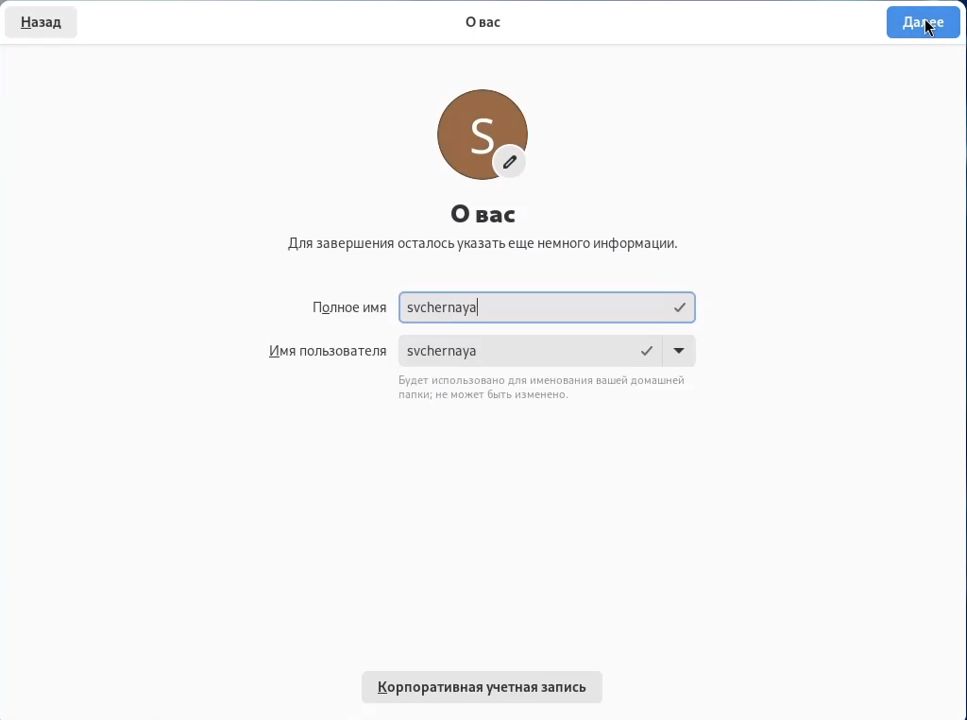
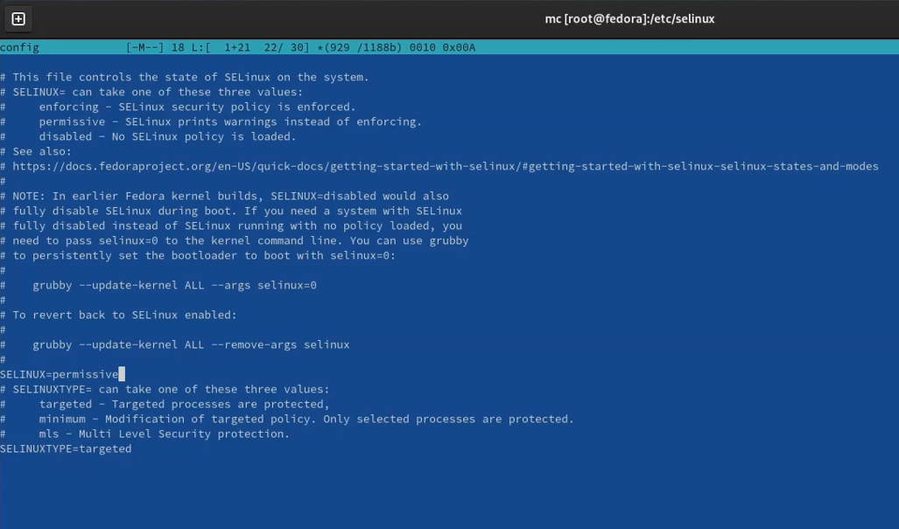
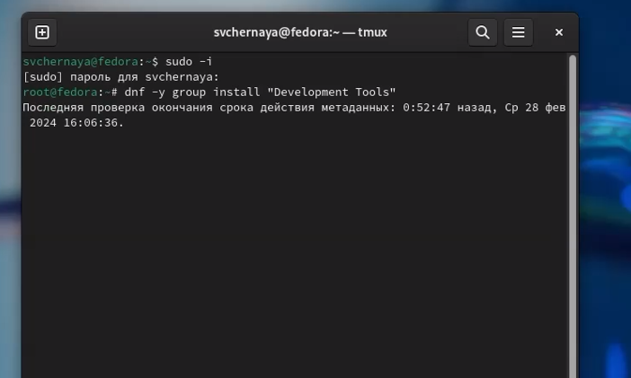
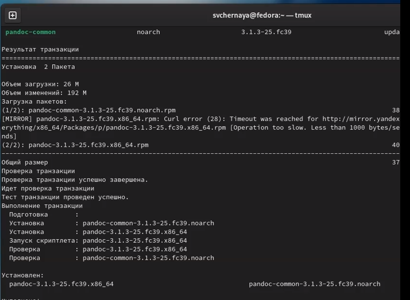

---
## Front matter
title: "Отчет по лабораторной работе №1"
subtitle: "Операционные системы"
author: "Чёрная София Витальевна"

## Generic otions
lang: ru-RU
toc-title: "Содержание"

## Bibliography
bibliography: bib/cite.bib
csl: pandoc/csl/gost-r-7-0-5-2008-numeric.csl

## Pdf output format
toc: true # Table of contents
toc-depth: 2
lof: true # List of figures
lot: true # List of tables
fontsize: 12pt
linestretch: 1.5
papersize: a4
documentclass: scrreprt
## I18n polyglossia
polyglossia-lang:
  name: russian
  options:
	- spelling=modern
	- babelshorthands=true
polyglossia-otherlangs:
  name: english
## I18n babel
babel-lang: russian
babel-otherlangs: english
## Fonts
mainfont: PT Serif
romanfont: PT Serif
sansfont: PT Sans
monofont: PT Mono
mainfontoptions: Ligatures=TeX
romanfontoptions: Ligatures=TeX
sansfontoptions: Ligatures=TeX,Scale=MatchLowercase
monofontoptions: Scale=MatchLowercase,Scale=0.9
## Biblatex
biblatex: true
biblio-style: "gost-numeric"
biblatexoptions:
  - parentracker=true
  - backend=biber
  - hyperref=auto
  - language=auto
  - autolang=other*
  - citestyle=gost-numeric
## Pandoc-crossref LaTeX customization
figureTitle: "Рис."
tableTitle: "Таблица"
listingTitle: "Листинг"
lofTitle: "Список иллюстраций"
lotTitle: "Список таблиц"
lolTitle: "Листинги"
## Misc options
indent: true
header-includes:
  - \usepackage{indentfirst}
  - \usepackage{float} # keep figures where there are in the text
  - \floatplacement{figure}{H} # keep figures where there are in the text
---

# Цель работы

Целью данной работы является приобритение практических навыков установки операционной системы на виртуальную машину, настройки минимально необходимых для дальнейшей работы сервисов.

# Задание

1. Создание виртуальной машины
2. Установка операционной системы
3. Работа с операционной системой после установки
4. Установка программного обеспечения для создания документации
5. Дополнительные задания                                         |

# Выполнение лабораторной работы

VirtualBox я устанавливала и настраивала при выполнении лабораторной работы в курсе "Архитектура компьютера и операционные системы"(раздел "Архитектура компьютеров"), поэтому сразу открываю окно приложения.(рис. @fig:001).

{#fig:001 width=70%}

Нажимая "создать", создаю новую виртуальную машину, указываю ее имя, путь к папке машины по умолчанию меня устраиваеи, выбираю тип ОС и версию(рис. @fig:002)

{#fig:002 width=70%}

Указываю объем основной памяти виртуальной машины, размером 4096 МБ(рис. fig:003)

{#fig:003 width=70%}

Выбираю создание нового виртуального диска и указываю его размер(рис. fig:004)

{#fig:004 width=70%}

Выбираю в VirtualBox настройку своей виртуальной машины, перехожу в "носители", добавляю новый привод оптических дисков и выбираю скаченный образ операционной системы Fedora(рис. @fig:005)

{#fig:005 width=70%}

Скачанный образ ОС был успешно выбран(рис. @fig:006)

{#fig:006 width=70%}

## Установка операционной системы

Запускаю созданную виртуальную машину для установки(рис. @fig:007)

{#fig:007 width=70%}

Выбираю язык для дальнейшего использования в процессе установки(рис. @fig:008)

{#fig:008 width=70%}
 
Раскладку клавиатуры оставляю по умолчанию(английская и русская), дату и время так же оставляю по умолчанию(Европа/Москва). Выбираю место установки(рис. @fig:009)

{#fig:009 width=70%}

Далее операционная система устанавливается. После установки нажимаю "завершить установку"(рис. @fig:010)

{#fig:010 width=70%}

Диск не отключался автоматически, поэтому отключаю носитель информации с образом(рис. @fig:012)

{#fig:012 width=70%}

Загружаю виртуальную машину и задаю имя пользователя(рис. @fig:013)

{#fig:013 width=70%}

Устанавливаю пароль пользователя (рис. @fig:014)

{#fig:014 width=70%}

## Работа с операционной системой после установки

Захожу в терминал и переключаюсь на роль супер-пользователя(рис. @fig:015)

{#fig:015 width=70%}

Обновляю все пакеты(рис. @fig:016)

{#fig:016 width=70%}

Устанавливаю программы для удобства работы в консоли(рис. @fig:017)

{#fig:017 width=70%}

Устанавливаю программы для автоматического обновления(рис. @fig:018)

{#fig:018 width=70%}

Перемещаюсь в директорию /etc/selinux, открываю md, ищу нужный файл (рис. @fig:019)

{#fig:019 width=70%}

Изменяю открытый файл: SELINUX=enforcing меняю на значение SELINUX=permissive(рис. @fig:020)

{#fig:020 width=70%}

Перезагружаю машину, захожу снова в ОС, запускаю терминал, запускаю терминальный мультиплексор tmux. Переключаюсь на роль супер-пользователя и устанавливаю средства разработки(рис. @fig:021)

{#fig:021 width=70%}

## Установка программного обеспечения для создания документации

Устанавливаю дистрибутив texlive(рис. @fig:022)

{#fig:022 width=70%}

Устанавливаю необходимые расширения для pandoc (рис. @fig:023)

{#fig:023 width=70%}

# Выводы

При выполнении данной лабораторной работы я приобрела практические навыки установки операционной системы на виртуальную машину, а так же сделала настройки минимально необходимых для дальнейшей работы сервисов.

# Ответы на контрольные вопросы

1. Учетная запись содержит необходимые для идентификации пользователя при подключении к системе данные, а так же информацию для авторизации и учета: системного имени (user name) (оно может содержать только латинские буквы и знак нижнее подчеркивание, еще оно должно быть уникальным), идентификатор пользователя (UID) (уникальный идентификатор пользователя в системе, целое положительное число), идентификатор группы (CID) (группа, к к-рой относится пользователь. Она, как минимум, одна, по умолчанию - одна), полное имя (full name) (Могут быть ФИО), домашний каталог (home directory) (каталог, в к-рый попадает пользователь после входа в систему и в к-ром хранятся его данные), начальная оболочка (login shell) (командная оболочка, к-рая запускается при входе в систему).

2. Для получения справки по команде: <команда> --help; для перемещения по файловой системе - cd; для просмотра содержимого каталога - ls; для определения объёма каталога - du <имя каталога>; для создания / удаления каталогов - mkdir/rmdir; для создания / удаления файлов - touch/rm; для задания определённых прав на файл / каталог - chmod; для просмотра истории команд - history

3. Файловая система - это порядок, определяющий способ организации и хранения и именования данных на различных носителях информации. Примеры: FAT32 представляет собой пространство, разделенное на три части: олна область для служебных структур, форма указателей в виде таблиц и зона для хранения самих файлов. ext3/ext4 - журналируемая файловая система, используемая в основном в ОС с ядром Linux.

4. С помощью команды df, введя ее в терминале. Это утилита, которая показывает список всех файловых систем по именам устройств, сообщает их размер и данные о памяти. Также посмотреть подмонтированные файловые системы можно с помощью утилиты mount.

5. Чтобы удалить зависший процесс, вначале мы должны узнать, какой у него id: используем команду ps. Далее в терминале вводим команду kill < id процесса >. Или можно использовать утилиту killall, что "убьет" все процессы, которые есть в данный момент, для этого не нужно знать id процесса.

# Выполнение дополнительного задания

Ввожу в терминале команду dmesg, чтобы проанализировать последовательность загрузки системы (рис. @fig:024).

{#fig:024 width=70%}

С помощью поиска, осуществляемого командой 'dmesg | grep -i <что ищем>', ищу версию ядра Linux: 6.1.10-200.fc37.x86_64 (рис. @fig:026).

{#fig:026 width=70%}

К сожалению, если вводить "Detected Mhz processor" там, где нужно указывать, что я ищу, то мне ничего не выведется. Это происходит потому, что запрос не предусматривает дополнительные символы внутри него (я проверяла, будет ли работать он с маской - не будет). В таком случае я оставила одно из ключевых слов (могла оставить два: "Mhz processor") и получила результат: 1992 Mhz (рис. @fig:030).

{#fig:030 width=70%}

Аналогично ищу модель процессора (рис. @fig:031).

{#fig:031 width=70%}

Объем доступной оперативной памяти ищу аналогично поиску частоты процессора, т. к. возникла та же проблема, что и там (рис. @fig:027).

{#fig:027 width=70%}

Нахожу тип обнаруженного гипервизора (рис. @fig:028).

{#fig:028 width=70%}

Последовательность монтирования файловых систем можно посмотреть, введя в поиск по результату dmesg слово mount (рис. @fig:029).

{#fig:029 width=70%}

# Список литературы{.unnumbered}

1. https://esystem.rudn.ru/mod/page/view.php?id=1098787
